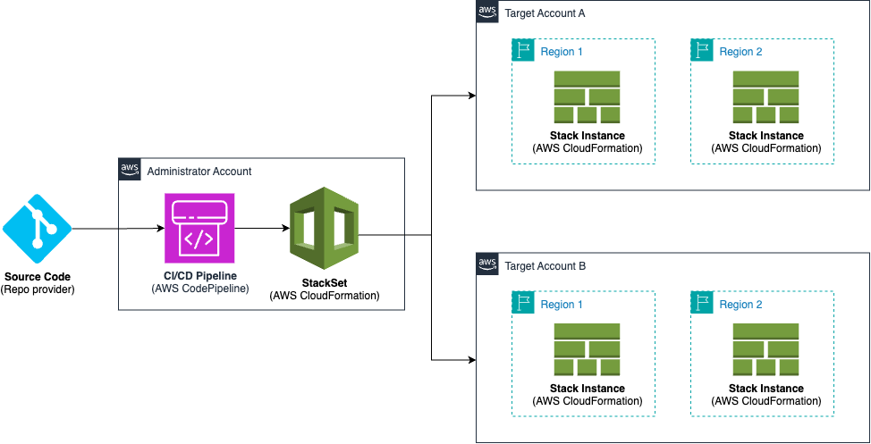

# AWS CloudFormation StackSets with CI/CD

This repository contains a pattern to deploy AWS CloudFormation StackSets using AWS CDK through a CI/CD pipeline.



It includes an example monitoring instance stack that deploys a dashboard in AWS CloudWatch. You can easily replace it with your stacks to test it.

## Table of Contents

- [Introduction](#introduction)
- [Pre-requisites](#pre-requisites)
- [Install](#install)
- [Setup environment](#setup-environment)
- [Deploy the CI/CD Pipeline](#deploy-the-cicd-pipeline)
- [Verification and Troubleshooting](#verification-and-troubleshooting)
- [Quality Tools](#quality-tools)
- [Cleanup](#cleanup)

## Introduction

The solution consists of four main CDK stacks:

1. **MonitoringStack** - The application template deployed via StackSets
   - CloudWatch dashboards focused on StackSet operations and account-level metrics
   - Metrics that are likely to show real data: CloudFormation operations, API usage, billing
   - CloudWatch alarms for StackSet failures, billing thresholds, and operational issues
   - SNS topic with email subscriptions for real-time notifications
   - Designed for multi-region deployment across AWS accounts

2. **StackSetStack** - Manages the CloudFormation StackSet deployment
   - CloudFormation StackSet resource with SELF_MANAGED permission model
   - Proper IAM role configuration for StackSet administration and execution
   - Support for multi-account and multi-region deployments

3. **PipelineStack** - Complete CI/CD automation pipeline
   - CodePipeline with source, validation and deployment stages
   - Multiple CodeBuild projects for code quality validation (PyLint, PyTest, Bandit, pip-audit)
   - Deployment preview before approval
   - Comprehensive IAM roles with least-privilege permissions and CDK Nag compliance

## Pre-requisites

- [AWS CLI](https://docs.aws.amazon.com/cli/latest/userguide/cli-chap-getting-started.html) configured for the administrator account
- [AWS CDK Toolkit](https://docs.aws.amazon.com/cdk/v2/guide/getting-started.html)
- [Python](https://www.python.org/downloads/) (3.11+)
- [Node.js](https://nodejs.org/en/download) and npm (for AWS CDK)
- A Git repository [compatible with AWS CodeConnections](https://docs.aws.amazon.com/dtconsole/latest/userguide/supported-versions-connections.html)
- An [AWS Organization](https://docs.aws.amazon.com/organizations/latest/userguide/orgs_introduction.html) configured
- An [AWS CodeConnections connection](https://docs.aws.amazon.com/dtconsole/latest/userguide/connections-create.html) to your repository


## Install

To install the dependencies of the project, first create a virtualenv:
```bash
python3 -m venv .venv
```

Then, activate it. If you are on macOS or Linux, run:

```bash
source .venv/bin/activate
```

If you are on Windows, run:

```bash
.venv\Scripts\activate.bat
```

Once the virtualenv is activated, you can install the required dependencies:

```bash
$ pip3 install -r requirements.txt -r requirements-dev.txt
```

## Setup environment

First, set the environment variables:

```bash
# Required for all deployments
export CDK_DEFAULT_ACCOUNT=<your-management-account-id>
export CDK_DEFAULT_REGION=<your-preferred-region>
export NOTIFICATION_EMAIL=<your-email@example.com>
export TARGET_ACCOUNTS=<account1>,<account2>
export DASHBOARD_NAME=<your-dashboard-name>
export ALARM_PREFIX=<your-alarm-prefix>
# Required for CI/CD pipeline deployment
export CODE_CONNECTION_ARN=<your-codeconnections-arn>
export REPOSITORY=<owner/repository-name>
```
- `CDK_DEFAULT_ACCOUNT`: Your AWS management account ID where the StackSet will be created
- `CDK_DEFAULT_REGION`: Primary AWS region for deployment (e.g., us-east-1)
- `NOTIFICATION_EMAIL`: Email address for CloudWatch alarm notifications
- `TARGET_ACCOUNTS`: Comma-separated list of AWS account IDs where stacks will be deployed
- `DASHBOARD_NAME`: Name for the CloudWatch dashboard (e.g., "MyMonitoringDashboard")
- `ALARM_PREFIX`: Prefix for CloudWatch alarm names (e.g., "MyApp")
- `CODE_CONNECTION_ARN`: ARN of your CodeConnections connection (for GitHub/GitLab integration)
- `REPOSITORY`: Repository in "owner/repo" format (e.g., "myorg/stacksets-blog")

#### Management Account Setup

1. **Bootstrap CDK in management account:**
   ```bash
   cdk bootstrap aws://$CDK_DEFAULT_ACCOUNT/$CDK_DEFAULT_REGION
   ```

2. **Deploy StackSet administration role:**
   ```bash
   ./prerequisites/deploy-admin-role.sh --region $CDK_DEFAULT_REGION
   ```

### Target Accounts Setup (Optional - Multi-Account Deployment Only)

> **⚠️ Multi-Account Deployment**: The following steps are only required if you want to deploy across **multiple AWS accounts**. If you're deploying to multiple regions within a **single account**, skip this section and proceed to deployment.

**After completing the setup of the administrator account, run the following for each target account:**

1. **Bootstrap CDK in target account:**
   ```bash
   # Switch to target account credentials
   cdk bootstrap aws://<TARGET_ACCOUNT_ID>/$CDK_DEFAULT_REGION
   ```
   Note: you must run this in every target account and region where you have never used AWS CDK before. If your region already has CDKToolkit stack you can skip this.
2. **Deploy StackSet execution role:**
   ```bash
   # From repo root with target account credentials
   ./prerequisites/deploy-execution-role.sh --management-account-id $CDK_DEFAULT_ACCOUNT --region $CDK_DEFAULT_REGION
   ```

3. **Repeat steps 1-2 for each additional target account**

## Deploy the CI/CD Pipeline

> **⚠️ For multi-account deployment**, ensure you've completed the setup steps above for both management and target accounts.

### Project Structure

```
stacksets-blog/
├── app.py                          # CDK app entry point
├── config.json                     # Configuration file (required)
├── requirements.txt                # Python dependencies
├── requirements-dev.txt            # Development dependencies
├── cdk.json                        # CDK configuration
├── pytest.ini                      # PyTest configuration
├── .pylintrc                       # PyLint configuration
├── .bandit                         # Bandit security scanner config
├── .coveragerc                     # Coverage configuration
├── stacksets_blog/                 # Main application package
│   ├── config.py                   # Configuration classes
│   ├── utils.py                    # Utility functions
│   ├── monitoring_stack.py         # Monitoring infrastructure
│   ├── stackset_stack.py          # StackSet management
│   └── pipeline_stack.py          # CI/CD pipeline implementation
├── prerequisites/                  # IAM role deployment scripts
│   ├── deploy-admin-role.sh        # Deploy StackSet admin role
│   ├── deploy-execution-role.sh    # Deploy StackSet execution role
│   ├── stackset-administration-role.yaml
│   └── stackset-execution-role.yaml
├── tests/                          # Test suite
└── docs/                           # Documentation assets
```

### Configuration File

The application requires a `config.json` file for StackSet and monitoring configuration:

```json
{
  "stackset": {
    "stack_set_name": "Custom-StackSets-Blog-Monitoring",
    "target_regions": ["us-east-1", "us-west-2"],
    "instance_stack_name": "MonitoringStack",
    "max_concurrent_percentage": 50,
    "failure_tolerance_percentage": 20,
    "region_concurrency_type": "SEQUENTIAL"
  },
  "monitoring": {
    "alarm_thresholds": {
      "BillingThreshold": 100.0,
      "SNSFailureThreshold": 1.0
    }
  },
  "pipelines": [
    {
      "environment": "dev",
      "branch_name": "main"
    }
  ]
}
```

**Configuration Parameters Explained:**

#### StackSet Section
- **`stack_set_name`**: Unique name for your CloudFormation StackSet (must be unique within your AWS account)
- **`target_regions`**: List of AWS regions where the monitoring stack will be deployed
- **`instance_stack_name`**: Name of the individual stack instances created by the StackSet
- **`max_concurrent_percentage`**: Maximum percentage of target accounts/regions to deploy to simultaneously (1-100)
- **`failure_tolerance_percentage`**: Percentage of deployments that can fail before stopping the operation (0-100)
- **`region_concurrency_type`**: How to deploy across regions - `"SEQUENTIAL"` (one at a time) or `"PARALLEL"` (simultaneously)

#### Monitoring Section
CloudWatch alarm thresholds for StackSet and account-level monitoring:
- **`BillingThreshold`**: AWS account billing threshold (USD, e.g., 100.0 = $100)
- **`SNSFailureThreshold`**: SNS delivery failure threshold (number of failures, e.g., 1.0)

Note: These thresholds focus on metrics that are guaranteed to have real data and are relevant to StackSet operations:
- **Billing metrics** are always available and show the cost impact of StackSet deployments
- **SNS metrics** monitor the notification system that alerts on StackSet issues
- Unlike EC2/RDS metrics, these will show data regardless of what resources exist in target accounts

#### Pipelines Section
CI/CD pipeline configuration for automated deployments:
- **`environment`**: Environment name (e.g., "dev", "staging", "prod") - used for pipeline naming and resource tagging
- **`branch_name`**: Git branch to monitor for changes (e.g., "main", "develop", "release")

**Customization Tips:**
- Adjust alarm thresholds based on your application's normal operating ranges
- Use lower `max_concurrent_percentage` for safer, slower deployments
- Set `failure_tolerance_percentage` to 0 for critical deployments that must succeed everywhere
- Add multiple pipeline configurations for different environments/branches

### Run the deployment command

Now that you have all set, run the following command to create the CI/CD pipeline in the administrator account:

   ```bash
   cdk deploy
   ```

Note: don't forget to set the environment variables from [Setup environment section](#setup-environment)

## Verification and Troubleshooting

### Verification

Once you have deployed everything you can check all the configuration.

#### Pipeline

If you log in to the administrator account in the region used in `CDK_DEFAULT_REGION` you will see the CI/CD pipeline:


#### StackSet

Once it finishes deploying you should see the StackSet stack in AWS CloudFormation and the StackSet created:


#### Stack Instances

If you log in to the stack instances account, you should see the stack instances and the StackSet execution role stacks created:


### Troubleshooting

- **Invalid principal errors**: Ensure administration role is deployed before execution roles
- **Access denied errors**: Verify you're using the correct account credentials for each step
- **SSM permission errors**: Ensure target accounts are CDK bootstrapped and execution roles have updated permissions
- **Stack instance creation failures**: Ensure execution roles are deployed in all target accounts before CDK deployment

## Quality Tools

Both the repository and the CI/CD Pipeline include the use and execution of security and quality code testing. These requirements can be found in `requirements-dev.txt` file.

### Bandit
[Bandit](https://bandit.readthedocs.io/en/latest/) library allows you to find common security issues in Python code. To do this, Bandit processes each file, builds an AST from it, and runs appropriate plugins against the AST nodes. The `.bandit` file indicates the configuration to apply.

### Dependency Audit
[Pip-audit](https://pypi.org/project/pip-audit/) is a library that allows you to scan Python environments for packages with known vulnerabilities.

### CDK audit
[cdk-nag](https://github.com/cdklabs/cdk-nag) allows you to check your CDK applications for best practices using a combination of available rule packs.

### Unit Testing
[PyTest](https://pypi.org/project/pytest/) is used to run unit tests against the AWS CDK code. It is used together with [CDK assertions](https://docs.aws.amazon.com/cdk/v2/guide/testing.html) module. You can find the unit tests in `tests` folder and the configuration in `pytest.ini` file.

### Linter
[PyLint](https://pypi.org/project/pylint/) analyzes the Python code without actually running it. It checks for errors, enforces a coding standard, looks for code smells, and can make suggestions about how the code could be refactored.

## Cleanup

You can delete the pipeline stack by running this command in the root of the cloned repository:

```
cdk destroy
```

And you can delete the StackSet stack by running:

```
cdk destroy -c deployment_type=app
```
