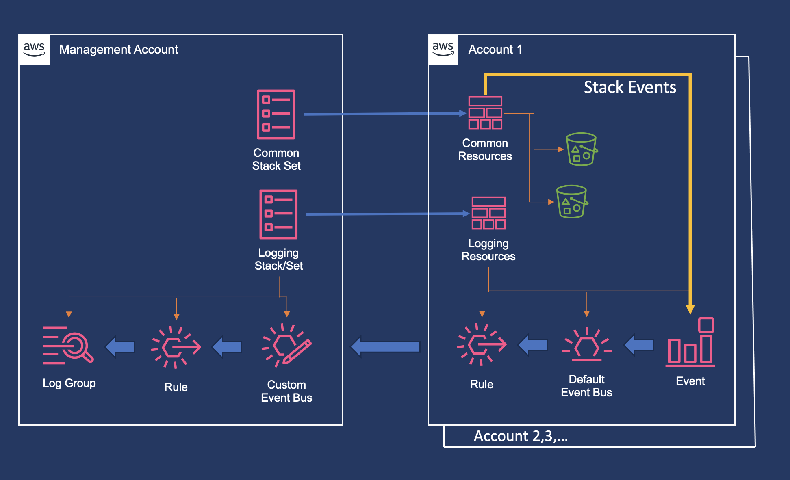
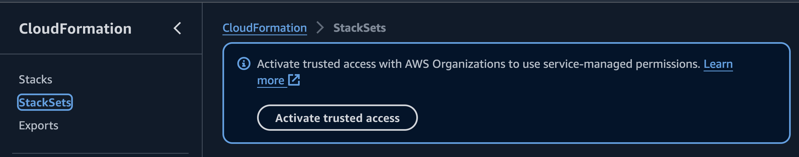

# CloudFormation StackSets Sample with Cross-Account Log Consolidation

This sample configures a service-managed stack set in an organization and pipes
all log events from the target accounts into the management account. The events 
are limited to the CloudFormation stack events, which helps to consolidate logs 
from stacks that are being deployed as part of a stack set to many environments.



## Prerequisites

You should have an AWS Organization structure set up with a primary management
account and several accounts under management. (Although not necessary for this
solution, in general it is highly recommended to set up your organization with
[AWS Control Tower](https://aws.amazon.com/controltower/), or to migrate to
Control Tower if you set up your landing zone manually.)

A typical starting point for an organization might look like this:

- root
  - core
    - Audit account
    - Log archive account
  - custom
    - Account 1
    - Account 2
  - Management account

Despite the fact that we have a standard Log archive account, we do not use
that one for the centralized logging in this sample, since that account is
meant for compliance and investigations, and should be locked down. The point
of centralized logging in this sample is to assist in troubleshooting, so that
if something goes wrong during a StackSets deployment, it is easy for the
administrator to see the errors from one place.

Make sure that you have enabled trusted access from the management account.



## Templates/Stacks

### `common-resources.yaml`

This is the template that will be deployed to all target accounts. It has the
common resources that we want to appear consistently in all accounts across the
organization. For sample purposes, the infrastructure is a simple one,
consisting of S3 buckets. If you are adapting this solution for your
environment, this is the template you would replace with whatever it is you
want to deploy across accounts and regions.

The consolidated logging solution is focused on events from stacks created with
this template. Filters are available on either the source side or the
destination to limit the results to only root cause failures.

### `common-resources-stackset.yaml`

This template deploys the stack set itself into the management account. For
this sample we are using IaC to define IaC. Instead of logging in to the
console to create the stack set, we define it in a template and deploy it via
CloudFormation.

### `log-setup-target-accounts.yaml`

Set up the logging infrastructure in target accounts to pipe all CloudFormation 
events to the management account.

### `log-setup-management.yaml`

Set up the logging infrastructure in the management account. This template also 
contains a stack set resource, to deploy the logging setup to target accounts.

## Deployment

In order to deploy this sample, you will need to first install
[Rain](https://github.com/aws-cloudformation/rain), which is necessary to
process the `!Rain` directives in the templates.

Deploy the logging resources to the management account and to the target accounts.

`rain --profile [org-management-account-admin] deploy log-setup-management.yaml`

Package the common resources template.

`rain pkg -x common-resources.yaml > common-resources-pkg.yaml`

Then deploy the sample resources that are common to each account, to cause the
CloudWatch log group in the management account to receive events. This template 
creates a stack set to manage the deployment of the packaged common resources template.

`rain --profile [org-management-account-admin] --experimental deploy common-resources-stackset.yaml`

## Build and Test

If you are doing development on this sample, you will need a Python environment
and cfn-lint installed.

Create a Python virtual environment.

```sh
python3 -m venv .env
source .env/bin/activate
```

Install cfn-lint

```sh
pip install cfn-lint
```

Build and validate

```sh
./build.sh
```


