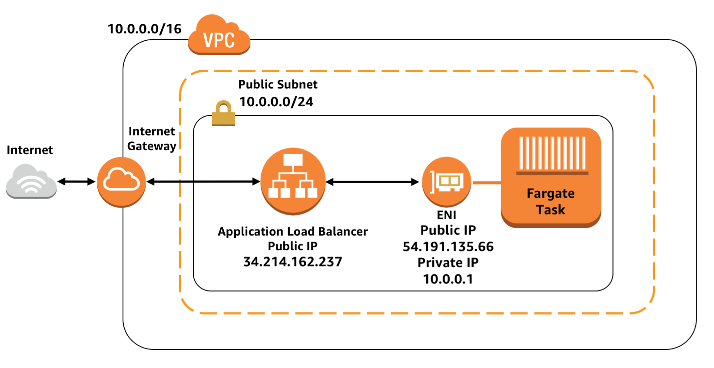
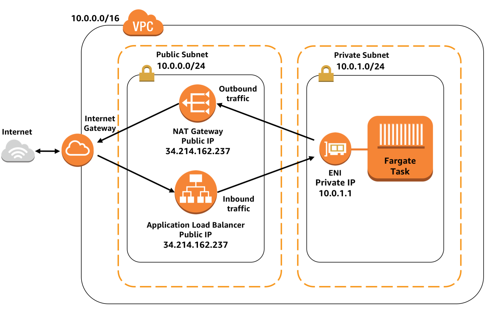
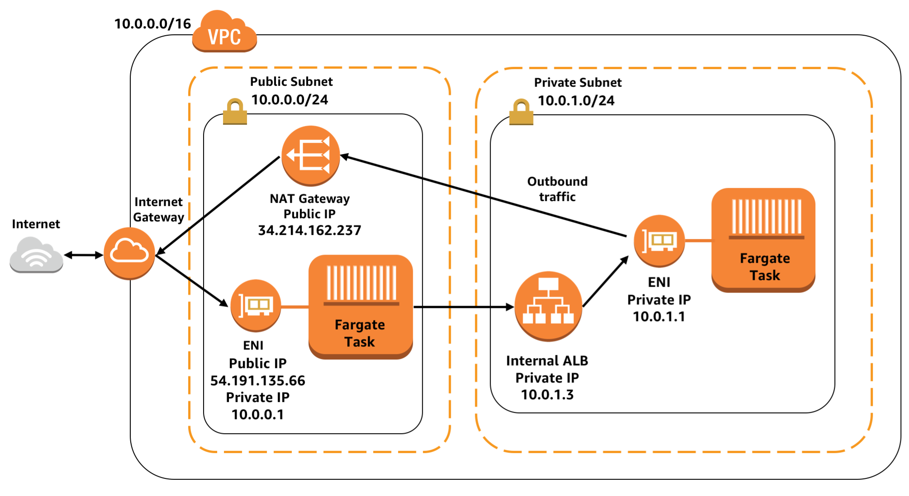

# Deploy containers using Elastic Container Service and CloudFormation

Several combinations of template are available in this folder. You can deploy containers with two different networking approaches:

- Public VPC subnet with direct internet access
- Private VPC subnet without direct internet access

You can choose two different options for hosting the containers:

- AWS Fargate for hands-off container execution without managing EC2 instances
- Self managed cluster of EC2 hosts for control over instance type, or to use reserved or spot instances for savings

You can also choose between two different ways of sending traffic to the container:

- A public facing load balancer that accepts traffic from anyone on the internet (ideal for a public facing web service)
- A private, internal load balancer that only accepts traffic from other containers in the cluster (ideal for a private, internal service).

To use these templates launch a cluster template for the launch type and networking stack that you want. Then launch a service template for each service you want to run in the cluster. When launching a service template its important to make sure the "StackName" value is filled in with the same name that you selected for the name of your cluster stack.

Each of the service stacks has default values prefilled for launching a simple Nginx container, but can be adjusted to launch your own container.

## Fully Public Container

This architecture deploys your container into its own VPC, inside a public facing network subnet. The containers are hosted with direct access to the internet, and they are also accessible to other clients on the internet via a public facing appliation load balancer.

### Run in AWS Fargate

1. Launch the [fully public](FargateLaunchType/clusters/public-vpc.yml) or the [public + private](FargateLaunchType/clusters/private-vpc.yml) cluster template
2. Launch the [public facing service template](FargateLaunchType/services/public-service.yml).

### Run on EC2

1. Launch the [fully public](EC2LaunchType/clusters/public-vpc.yml) or the [public + private](EC2LaunchType/clusters/private-vpc.yml) cluster template
2. Launch the [public facing service template](EC2LaunchType/services/public-service.yml).

&nbsp;

&nbsp;

## Publicly Exposed Service with Private Networking

This architecture deploys your container into a private subnet. The containers do not have direct internet access, or a public IP address. Their outbound traffic must go out via a NAT gateway, and receipients of requests from the containers will just see the request orginating from the IP address of the NAT gateway. However, inbound traffic from the public can still reach the containers because there is a public facing load balancer that can proxy traffic from the public to the containers in the private subnet.

### Run in AWS Fargate

1. Launch the [public + private](FargateLaunchType/clusters/private-vpc.yml) cluster template
2. Launch the [public facing, private subnet service template](FargateLaunchType/services/private-subnet-public-service.yml).

### Run on EC2

1. Launch the [public + private](EC2LaunchType/clusters/private-vpc.yml) cluster template
2. Launch the [public facing, private subnet service template](EC2LaunchType/services/public-service.yml).

&nbsp;

&nbsp;

## Internal Service with Private Networking

This architecture deploys your container in a private subnet, with no direct internet access. Outbound traffic from your container goes through an NAT gateway, and receipients of requests from the containers will just see the request orginating from the IP address of the NAT gateway. There is no acess to the container for the public. Instead there is a private, internal load balancer that only accepts traffic from other containers in the cluster. This is ideal for an internal service that is used by other services, but should not be used directly by the public.

### Run in AWS Fargate

1. Launch the [public + private](FargateLaunchType/clusters/private-vpc.yml) cluster template
2. Launch the [private service, private subnet template](FargateLaunchType/services/private-subnet-private-service.yml).

### Run on EC2

1. Launch the [public + private](EC2LaunchType/clusters/private-vpc.yml) cluster template
2. Launch the [private service, private subnet template](EC2LaunchType/services/private-service.yml).

