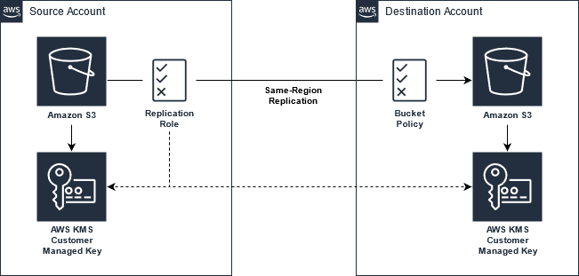

# S3 Cross-Account Replication with KMS

## Description

Example of cross-account, same-region, S3 bucket replication (v2) using server-side encryption with customer-managed KMS keys.

## Notes

- The source and destination resources should be deployed to the same region in different AWS Accounts.
- Deploy the destination account resources first.
- The destination S3 bucket must exist before configuring replication on the source bucket.
- CloudFormation stack name: replication-demo
- Source bucket name syntax: {stack-name}-{source-account}-bucket
- Destination bucket name syntax: {stack-name}-{destination-account}-bucket

## Resources

- [Amazon S3 - Replicating objects](https://docs.aws.amazon.com/AmazonS3/latest/userguide/replication.html)
- [Changing the replica owner](https://docs.aws.amazon.com/AmazonS3/latest/userguide/replication-change-owner.html)
- [Replicating objects created with server-side encryption (SSE) using KMS keys](https://docs.aws.amazon.com/AmazonS3/latest/userguide/replication-config-for-kms-objects.html)

## Instructions

1. The source and destination resources should be deployed to the same region in different AWS Accounts.
1. The CloudFormation stack names must be the same in both accounts. This is because of the resource naming convention used in the example templates.
1. Deploy the destination.yml template by using CloudFormation in the destination account. The destination S3 bucket must exist before configuring a replication rule on the source bucket.
    1. Name the stack "replication-demo".
    1. Enter the AWS Account Id of the source account in the AccountIdSource parameter.
    1. The destination bucket will be named: replication-demo-{destination-account}-bucket
1. Deploy the source.yml template by using CloudFormation in the source account.
    1. Be sure to select the same region as the destination account resources.
    1. Name the stack "replication-demo".
    1. Enter the AWS Account Id of the destination account in the AccountIdDestination parameter.
    1. The source bucket will be named: replication-demo-{source-account}-bucket

## Testing

Upload objects to the source account S3 bucket. After a couple mins, the objects should be replicated to the destination account S3 bucket.